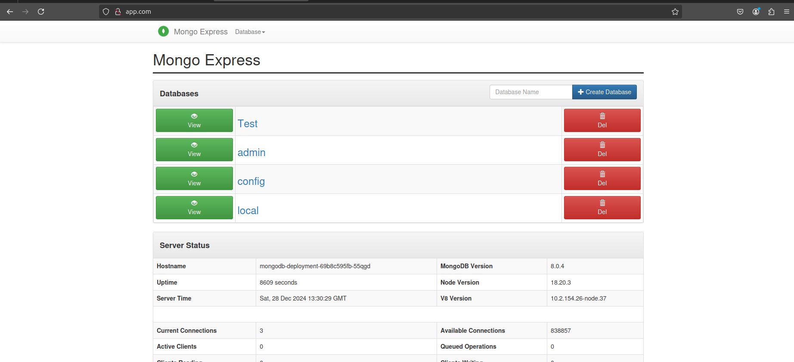

# MongoDB and Mongo Express Deployment with Ingress

This project demonstrates how to deploy MongoDB and Mongo Express using Kubernetes with Ingress. It includes all necessary Kubernetes manifests and commands for setup, monitoring, debugging, and external access.

---



---

## **Commands Overview**

### **1. Apply Kubernetes Manifests**
Apply the manifests in the following order:

```bash
kubectl apply -f mongo-secret.yaml
kubectl apply -f mongo.yaml
kubectl apply -f mongo-configmap.yaml
kubectl apply -f mongo-express.yaml
```

### **2. Install Ingress Controller**
To enable Ingress in your Kubernetes cluster, install an Ingress controller such as NGINX.

#### **Install NGINX Ingress Controller on Minikube**:
```bash
minikube addons enable ingress
```

#### **Verify the Ingress Controller Installation**:
```bash
kubectl get pods -n kube-system | grep ingress
```

### **3. Monitor the Deployment**
Use the following commands to monitor the Pods, Services, and Secrets:

#### **Get Pods**
```bash
kubectl get pod
kubectl get pod --watch
kubectl get pod -o wide
```

#### **Get Services**
```bash
kubectl get service
```

#### **Get Secrets**
```bash
kubectl get secret
```

#### **Get All Resources (Filtered by MongoDB)**
```bash
kubectl get all | grep mongodb
```

---

### **4. Debugging Commands**
Use these commands to troubleshoot issues with the deployment:

#### **Describe the MongoDB Pod**
```bash
kubectl describe pod mongodb-deployment-xxxxxx
```

#### **Describe the MongoDB Service**
```bash
kubectl describe service mongodb-service
```

#### **View Logs from Mongo Express**
```bash
kubectl logs mongo-express-xxxxxx
```

---

### **5. Access the External Service (Minikube)**

To access the Mongo Express service externally in a Minikube environment, use the following command:

```bash
minikube service mongo-express-service
```

This will output a URL. Open the URL in your browser to access Mongo Express.

OR

To access Mongo Express using a custom domain (e.g., app.com), follow these steps to check the Ingress Host and Address:
Watch the Ingress Resource

Use the following command to watch the Ingress resource and retrieve the Host and Address:

```bash
kubectl get ingress -n default --watch
```

Configure  ```/etc/hosts```

Add an entry to your /etc/hosts file that maps app.com to the Ingress controller's external IP:

1. Edit the ```/etc/hosts``` file:

```bash
sudo nano /etc/hosts
```

2. Add the following line, replacing <external-ip> with the actual IP address or hostname:

```bash
<external-ip>   app.com
```

3. Save and exit the file.

Now, you can access Mongo Express at ```http://app.com```.

---

## **Project Structure**

- **`mongo-secret.yaml`**: Contains the MongoDB username and password stored as Kubernetes secrets.
- **`mongo.yaml`**: Deploys MongoDB as a Pod and Service.
- **`mongo-configmap.yaml`**: Stores configuration for MongoDB such as database URL.
- **`mongo-express.yaml`**: Deploys Mongo Express as a Pod and Service for a web-based MongoDB interface.

---

## **Usage**
1. Apply all manifests using the commands in the correct order.
2. Install the Ingress controller if not already installed.
3. Monitor and debug the deployment using the provided commands.
4. Access Mongo Express using the Minikube service URL.

---

### **Notes**
- Ensure Minikube is running before deploying the manifests.
- Replace `xxxxxx` with the actual Pod name from the `kubectl get pod` output.
- For production environments, consider using a LoadBalancer or Ingress Controller for external access instead of Minikube.

